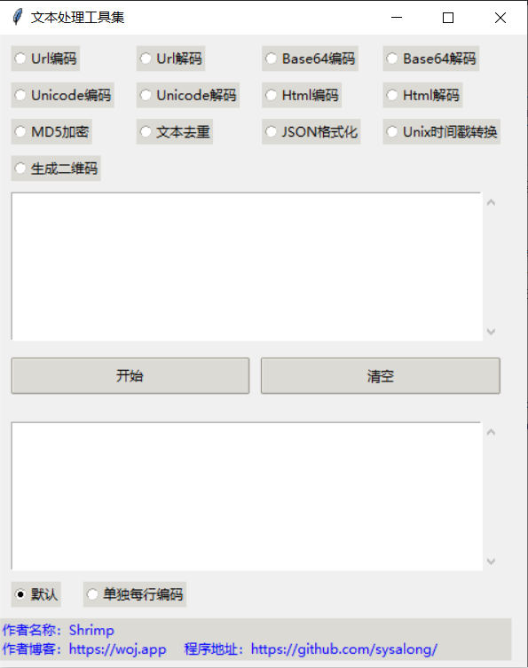

程序功能说明

因为本人经常会处理一些数据，总会用到一些小功能，但是都是通过网络在线的，如果哪天没网络实在是不便，然后训练openAI，写了一个小工具集，功能有很多，如题功能如下：

# -
功能选项包括“Url编码”、“Url解码”、“Base64编码”、“Base64解码”、“Unicode编码”、“Unicode解码”、“Html编码”、“Html解码”、"字母全小写", "字母全大写", “MD5加密”、“文本去重”、“JSON格式化”、“Unix时间戳”、“生成二维码”。

这里的“Unix时间戳”功能是指把Unix timestamp转换为 “年-月-日”的形式。

